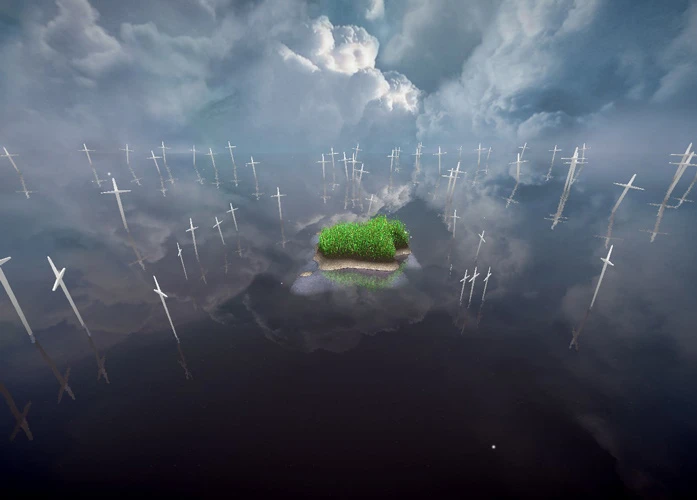
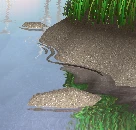
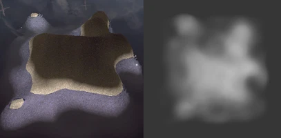
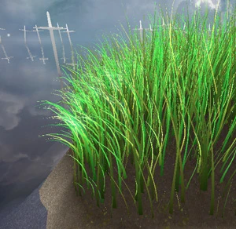
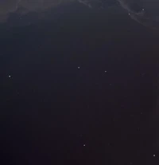
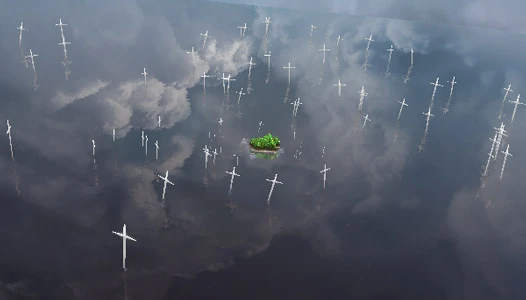
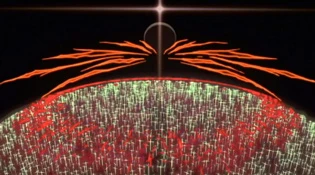

# Rapport - Projet Programmation Graphique 3D
Titouan LAURENT - Master 1 I3D
 
## Note importante
J'ai volontairement modifié le fichier `easywebgl/easy_wgl_desktop.js` (lignes 247 à 259) afin d'apporter la possibilité de lancer le rendu de la scène lorsqu'on le souhaite (jusque-là le rendu se lançait automatiquement après l'appel à la fonction `init_wgl()`).  De cette manière je peux lancer le rendu lorsque je me suis bien assuré d'avoir chargé tous les fichiers nécessaires (textures, fichiers `.obj`, etc.).
## Éléments d'explications et précisions
### L'eau
 
J'ai pris la liberté d'utiliser la heightmap de l'ile pour générer un effet de vaguelettes sur les contours de l'ile.

Concernant le calcul de la normale, je n'ai pas réussi à ré-utiliser la normal-map fournie de manière adéquate. De ce fait, je me contente de "distordre" la normale du plan de l'eau à l'aide de la texture de carte de distortion fournie (ce qui est forcément bien moins précis).

### L'île/le terrain
 
La géométrie du maillage est générée procéduralement en JavaScript (*il s'agit d'une grille plate*). Le relief de l'île est généré dans le vertex shader à l'aide d'une texture de heightmap (*à partir de laquelle la normale est également calculée*).

Trois textures sont utilisées et mixées ensemble en fonction de l'altitude du terrain.
### L'herbe
 
Un seul brin d'herbe est généré procéduralement en JavaScript. Le nombre de subdivisions verticales peut-être ajusté à la génération du maillage. 
Ensuite au rendu on instancie le rendu de milliers de brins :
- sous forme d'une grille
- on ajoute du bruit dans la position de chaque brins
- on ajoute du bruit dans la taille de chaque brins
- on ajoute du bruit dans la rotation de chaque brins
- on fait légèrement varier la couleur aléatoirement pour chaque brins
- on utilise la texture de heightmap du terrain pour :
    - changer la position verticale des brins
    - changer la taille des brins en fonction de l'altitude
- les animations de bourasques de vent sont gérées avec un bruit procédural calculé dans le vertex shader
#### Nb:
Faire de l'ombrage/éclairage sur les brins d'herbes s'est révélé être plus compliqué que prévu car dans la réalité les brins d'herbes sont loins d'être opaques (par transluminescence). J'ai donc triché en ajoutant une lumière ambiante à l'herbe + un dégradé pour l'ombrage en profondeur sur la hauteur des brins.
### Les particules
 
Les particules sont rendues par instanciation de simple billboards 2D. Leur mouvement est généré dans le vertex shader à l'aide du bruit procédural (le même que pour le vent dans l'herbe). Leur texture est générée procéduralement dans le fragment shader.
### Les croix
 
Rendues par instanciation également, leur rôle est surtout esthétique et en partie pratique (la scène faisait vide sinon, et elles ajoutent de la profondeur). 
Mon inspiration vient d'une certaine scène dans la série animée *Evangelion* (voir image ci-dessous). 

### Le ciel
Je me sers des deux textures de skybox fournies. Deux animations sont alors visibles :
- Une première avec une rotation du ciel (simuler une impression de déplacement des nuages).
- Une seconde avec l'alternance dans l'affichage des deux textures de ciel.
### Effet en post-processing
Deux effets graphiques sont appliqués en post-processing :
- De l'éblouissement (bloom)
    - À noter que j'effectue un mixage de la texture d'éblouissement avec celle de la scène assez arbitraire et imprécis, mais dont le résultat est visuellement plutôt satisfaisant (utilisation de la fonction `max()` en l'occurrence)
- Du vignettage (assombrissement aux abords des coins de l'image)